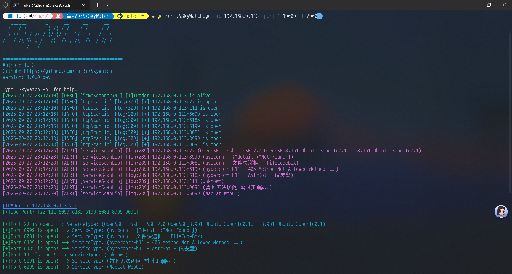

# SkyWatch

<div align="center">
  
</div>

## 项目简介(AI写的)
SkyWatch是一款高效的网络扫描工具，用于快速探测网络中的存活主机、开放端口和服务类型。该工具具有多线程扫描、灵活的参数配置以及友好的结果展示界面，适用于网络安全评估和资产管理。

## 项目架构

SkyWatch采用模块化设计，主要分为以下几个核心模块：

### 1. 命令处理模块 (userCommandProcesser)
负责解析用户输入的命令行参数，支持IP地址、端口范围、扫描线程、超时时间等多种参数配置。

### 2. 扫描模块 (scanner)
包含多种扫描器实现：
- **ICMP扫描器**：用于探测主机存活状态
- **TCP扫描器**：检测目标主机的开放端口
- **服务扫描器**：识别开放端口上运行的服务类型

### 3. 结果展示模块 (resultBoard)
负责以彩色终端输出的方式展示扫描结果，包括存活主机、开放端口和服务类型等信息。

### 4. 第三方库 (thirdBody)
提供各种底层功能支持：
- IP处理库：解析和生成IP地址范围
- 端口处理库：解析端口范围
- TCP扫描库：实现高可靠性的TCP端口扫描
- 服务识别库：识别常见网络服务

```
SkyWatch/
├── SkyWatch.go          # 主程序入口
├── units/
│   ├── resultBoard/     # 结果展示模块
│   ├── scanner/         # 扫描核心模块
│   └── userCommandProcesser/  # 命令处理模块
└── thirdBody/           # 第三方功能库
    ├── filterLib/       # 过滤规则库
    ├── icmpScanLib/     # ICMP扫描库
    ├── ipProcesser/     # IP处理库
    ├── portProcesser/   # 端口处理库
    ├── serviceScanLib/  # 服务扫描库
    └── tcpScanLib/      # TCP扫描库
```

## 项目用法

### 基本用法
```bash
# 编译项目
go build SkyWatch.go

# 运行扫描
./SkyWatch -ip 192.168.1.1-10 -port 80,443,8080-8090
```

### 命令行参数说明
| 参数 | 说明 | 示例 |
|------|------|------|
| -ip | 指定要扫描的IP地址或IP范围 | `-ip 192.168.1.1` 或 `-ip 192.168.1.1-10` |
| -ip_list | 指定包含IP地址列表的文件路径 | `-ip_list ip.txt` |
| -port | 指定要扫描的端口或端口范围 | `-port 80,443` 或 `-port 1-1000` |
| -Pn | 不使用ICMP扫描方法 | `-Pn` |
| -top | 扫描最常用的端口 | `-top` |
| -T | 设置扫描线程数 | `-T 500` |
| -timeout | 设置超时时间(毫秒) | `-timeout 1000` |

## 指令示例

### 1. 扫描单个IP地址的特定端口
```bash
./SkyWatch -ip 192.168.1.1 -port 80,443,8080
```

### 2. 扫描IP地址范围的常用端口
```bash
./SkyWatch -ip 192.168.1.1-254 -top -T 300
```

### 3. 从文件中读取IP地址列表进行扫描
```bash
./SkyWatch -ip_list ip.txt -port 1-1000 -timeout 1000
```

### 4. 不使用ICMP扫描，直接扫描指定IP的端口
```bash
./SkyWatch -ip 192.168.1.1-10 -port 1-65535 -Pn -T 500
```

## 参考项目
- [ServerScan](https://github.com/Adminisme/ServerScan.git)

## 作者信息
- Author: TuF3i
- Github: https://github.com/TuF3i/SkyWatch
- Version: 1.0.2-dev

## License
This project is licensed under the MIT License - see the [LICENSE](LICENSE) file for details.