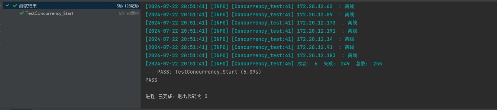

# GoPing

## 介绍
使用go实现的ICMP检测模块
## 安装

```shell
go get gitee.com/liumou_site/GoPing
```

## 使用


### 单独ping

```go
package main

import 	(
	"fmt"
    gp "gitee.com/liumou_site/GoPing"
)

func main()  {
	// 初始化一个Ping实例，用于对指定的域名进行ping操作
	// 参数"baidu.com"是目标域名，8是ping的次数，Data是ping的数据包内容
	ping, err := gp.New("baidu.com", 3)
	// 如果初始化过程中出现错误，则输出错误信息并终止程序
	if err != nil {
		fmt.Println(err)
		return
	}
	// 确保在函数返回前关闭ping实例，释放相关资源
	defer func(ping *gp.PingSet) {
		err := ping.Close()
		if err != nil {
			fmt.Println(err)
		}
	}(ping)
	// 执行ping操作，这里指定ping的次数为5
	err = ping.Ping(5)
	if err != nil {
		fmt.Println(err)
		return 
	}
	// 输出ping操作的总次数，这里查询的是次数6的ping操作次数
	fmt.Println(ping.PingCount(6))
}
```

### 并发ping

```go
package main

import (
	gp "gitee.com/liumou_site/GoPing"
	"gitee.com/liumou_site/gns"
	"gitee.com/liumou_site/logger"
)

func main() {

	// 初始化一个IP子网
	// 获取本机使用的IP地址
	sub := gns.NewIp()
	ip, err := sub.GetUseIP()
	if err != nil {
		logger.Error(err)
		return
	}
	// 通过本机使用的IP地址 生成一个IP列表，用于后续的并发检测
	ips, _ := gns.IpGenerateList(gns.IpCutSubnet(ip), 1, 10)
	// 创建一个并发处理实例
	p := gp.NewConcurrency(ips)
	// 启动并发检测
	p.Start()
	// 遍历结果，输出每个IP的在线/离线状态
	for k, v := range p.Result {
		if v {
			logger.Info(k, " : 在线")
		} else {
			logger.Info(k, " : 离线")
		}
	}
	// 输出成功的数量、失败的数量以及总共处理的IP数量
	logger.Info("成功：", p.Success, " 失败：", p.Fail, " 总数：", p.Total)
}

```

测试效果

